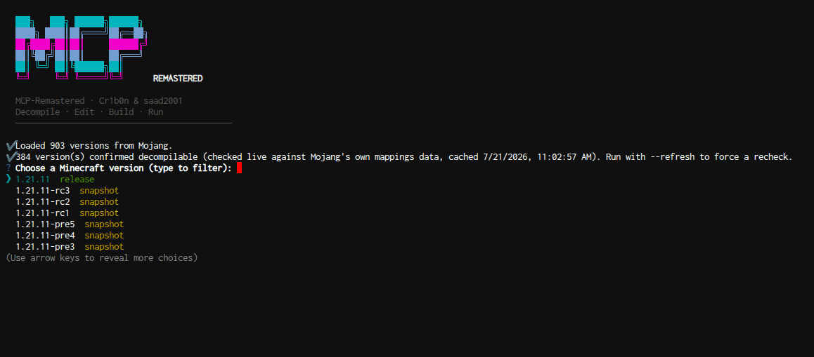

# MCP-Remastered



A modern Minecraft decompilation workspace manager. Pick any version from
Mojang's version list that has official mappings (1.14.4+), and it
downloads, deobfuscates, and decompiles it into editable Java source,
then generates a per-version CLI scaffold to build and run.

Created by Cr1b0n & saad2001.

## How it works

**`node bin/create.js`** fetches Mojang's live version manifest, lets you
fuzzy-search/select a version, and runs the full pipeline:

- Downloads the official client jar
- Downloads Mojang's official mappings (published for 1.14.4 and later)
- Downloads shared tooling into `.tools/` (cached across versions):
  - **ForgeAutoRenamingTool** -- deobfuscates using Mojang's mappings
  - **Vineflower** -- decompiles the deobfuscated jar to Java source
- Extracts `.java` files into `src/` and resources into `src/resources/`,
  auto-fixing known decompiler artifacts
- Writes `metadata.json`, `build.js`, `properties.js`, and `app.js`
- Each version workspace is fully independent

**Inside a version folder** (`cd <version>/`), `node app.js` gives you:

| Flag | Description |
|------|-------------|
| `--build` | Package `<version>-remastered.jar` using a hybrid strategy: seeds from the deobfuscated jar (always valid bytecode), then recompiles only changed source files on top |
| `--run` | Best-effort dev launch of the built jar (sets up offline-mode game args) |
| `--assets-install` | Download all game assets (objects + index) from Mojang's resources server |
| `--i-missing-assets` | Install only missing assets (skips cached files) |
| `--fix` | Re-scan `src/` and auto-fix known decompiler artifacts |
| `--clean` | Delete `build/` |
| `--info` | Show version metadata |
| `--setup` | Interactive wizard to configure project name, JDK, memory, game dir, assets dir |
| `--gemini` | Interactive Gemini AI assistant for modding help |

### Hybrid build strategy

Rather than attempting a full clean recompile of all decompiled source (which
nearly always fails due to Vineflower's imperfect output), the build:

1. **Seeds** `build/classes/` by extracting every `.class` file from the
   deobfuscated jar -- this gives you a complete, working class tree
2. **Overlays** recompiled source files on top by running `javac` only on
   files that have changed since the last build
3. **Packages** everything into a runnable jar

This means `--build` always produces a working jar on the first run, and your
source edits take effect immediately. Files that fail to compile (due to
decompiler artifacts) are silently backed by the deobfuscated bytecode.

### Assets

Assets (sounds, textures, language files) are downloaded separately via
`--assets-install`. They are stored by hash in `assets/objects/` and shared
across versions when they share the same resource URL. Use `--i-missing-assets`
to fill in gaps without re-downloading everything.

### Incremental compilation

Only source files whose modification time is newer than `metadata.json` are
recompiled. This makes repeated build cycles fast -- edit a file, run
`--build`, and only that file is recompiled.

## Requirements

- **Node.js 18+**
- **A full JDK 17+ (21 recommended)** -- `javac` must be available for
  `--build`. The tool detects installed JDKs and lets you pick one per
  version workspace (e.g., JDK 8 for older versions like 1.14.4).
- Internet access to `piston-meta.mojang.com`, `maven.minecraftforge.net`,
  and `repo1.maven.org` (Maven Central).

## Install

```bash
git clone https://github.com/Cr1b0n/MCP-Remastered.git
cd MCP-Remastered
npm install
node bin/create.js
```

## Per-version JDK detection

MCP-Remastered scans your system for installed JDKs and suggests the best one
for each Minecraft version. Older versions (1.14.x, 1.15.x) need JDK 8;
newer versions work with JDK 17+. You can select a different JDK during
setup, or re-run `node app.js --setup` to change it later.

## Decompiler artifacts

Vineflower occasionally emits patterns that are not valid Java -- for example,
a diamond operator inside a cast like `(Supplier<>)`, which is only legal in
`new Foo<>()` context. New workspaces are auto-fixed during extraction. For
existing workspaces, run `--fix` to clean them up without re-downloading or
re-decompiling.

If you encounter a new invalid-syntax pattern that is not caught, it can be
added to `lib/fixups.js` -- rules are simple regex + replacement pairs.

## Tool versions

Pinned in `lib/pipeline.js` (`ART_VERSION`, `VINEFLOWER_VERSION`). If a
download returns 404, the version may need bumping to the latest from:

- https://maven.minecraftforge.net/net/minecraftforge/ForgeAutoRenamingTool/
- https://repo1.maven.org/maven2/org/vineflower/vineflower/

## Experimental: Server support

Pass `--server` to `bin/create.js` to decompile the Minecraft server instead
of the client. For example:

```bash
node bin/create.js --server
```

This is a work-in-progress and should be considered experimental. The server
jar format changed to a "bundler" layout in 1.20+ (the real server code is
nested inside a wrapper jar), and support for this is still being refined.
Server source is decompiled from the nested jar and the workspace is named
`<version>-server`. Use `node app.js --server` to launch the dedicated server
from a server workspace. Many features like `--assets-install` and `--run`
are not applicable to server workspaces.

Do not rely on server workspaces for production use. This feature is
temporary and may be reworked or removed.
