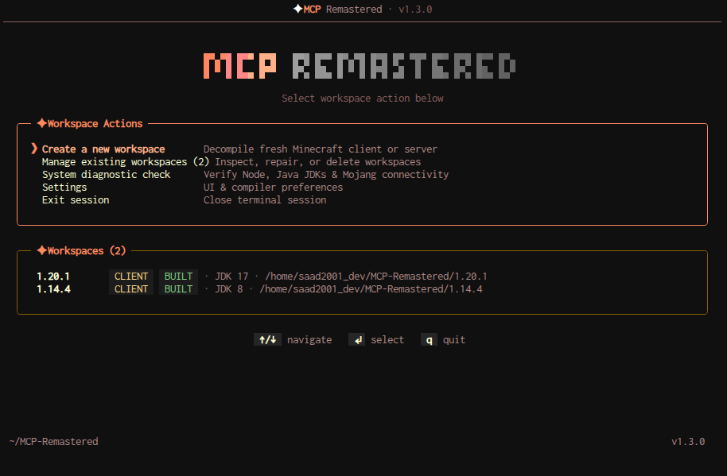

# /- MCP-Remastered -\



A Minecraft client & server decompiler pack. Downloads vanilla Minecraft jars and runs the decompiler pipeline to produce clean, decompiled source trees.

```bash
npm start           # interactive menu
npm run create      # new workspace wizard
npm run doctor      # system diagnostic
npm run list        # list all workspaces
```

## Features

- **Workspace management** — create, list, repair, delete decompiled projects
- **Version manifest** — fetches all release/snapshot/old-beta versions from Mojang
- **Progress display** — spinners, progress bars, live pipeline status
- **13 themes** — Dawn, Dusk, Midnight, Forest, Ocean, Lava, Violet, Mono, Sakura, Nord, Solarized, Dracula, OneDark
- **Settings** — theme picker persists to `bin/settings.json`
- **Smart terminal layout** — full banner mode on large screens, compact text view on small terminals
- **No AI, no telemetry** — pure local decompilation

## Requirements

- Node.js ≥ 20
- Java JDK 17+ (for decompilation)
- Internet connection (version manifest lookup)

## Project Structure

```
bin/menu.js          interactive main menu
bin/create.js        workspace creation & management
bin/settings.json    user preferences
lib/banner.js        gradient ASCII art + header
lib/mcptui/          TUI components (renderer, theme, prompts, dashboard, loading)
templates/           server.js & client.js pipeline templates
```

## License

GNU GENERAL PUBLIC LICENSE

## Owners

Made by cr1b0n with saad2001's help.

### random stuff that no one cares 

**There are so many bugs right now and I dont want to fix them, its like that video I see about "added more bugs to fix later" lmao. but yeah I wont fix them until I really want to update this project cuz its actually pain in the ass, I now start to use opencode becouse I dont really have alot of time latelly, and I am working on a mic project so yeah, see you on youtube I guess**
